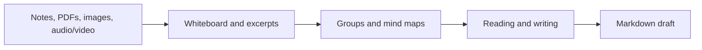

# ThoughtSpace Whiteboard

[English](README.md) · [中文](README.zh-CN.md)

A visual research and writing workspace for Obsidian. Arrange linked Markdown notes, text, images, and PDFs on a whiteboard, connect ideas with mind maps, and turn grouped material into a Markdown draft. Your notes remain files in your vault.

**Desktop only · Obsidian 1.13.7 or newer.**

## Start here

**[Complete English tutorial](docs/USER-GUIDE.md) · [完整中文教程](docs/USER-GUIDE.zh-CN.md)**

The guides cover the whole workflow, not just the latest release. English instructions include the current Chinese button names so you can find them in the interface.

| What you want to do | Start with |
| --- | --- |
| Install and make your first board | [Installation](docs/USER-GUIDE.md#installation) → [Ten-minute quick start](docs/USER-GUIDE.md#quick-start) |
| Build and fold a topic tree | [Mind maps](docs/USER-GUIDE.md#mind-maps) |
| Read notes/PDFs and collect evidence | [Reading and excerpts](docs/USER-GUIDE.md#reading) |
| Turn material into an article | [Writing from a board](docs/USER-GUIDE.md#writing) |
| Watch, capture frames and take timestamp notes | [Audio/video workspace](docs/USER-GUIDE.md#audio-video) |
| Change mouse/keyboard behavior or troubleshoot | [Controls](docs/USER-GUIDE.md#controls) · [Troubleshooting](docs/USER-GUIDE.md#troubleshooting) |



## Built-in audio and video workspace

Open **Audio/video notes** from the ribbon, a media file's context menu, or the command palette. Use a **main tab, right sidebar, or native Obsidian popout window**. Focus mode keeps only the player visible. No whiteboard or external player plugin is required.

Wide windows place the viewer on the left and stack the composer above the timeline on the right. Save and pagination controls remain fixed. Use Layout to adjust the split and More for native playback placements or sending media to a board. Collapse the picture to give notes more space without rebuilding playback. Narrow panes switch between writing and the timeline without losing drafts. Filter all, text, or screenshot entries; locate the current time or last entry. Pagination mounts at most 50 records while search covers all loaded history. Comfortable and compact timeline density switch without rebuilding records or the editor. Local screenshots have lazy thumbnails and full-size previews. Advanced playback controls live under **More**.

- Playback includes speed, ±10-second and exact-time seeking, A–B loops, native fullscreen/Picture-in-Picture where supported, and matching `.vtt`/`.srt` subtitle files.
- Capture a timestamp, write Markdown, or attach a video frame to a draft. **Save** or `Ctrl/Cmd + Enter` appends it to a regular Markdown note. Merely opening media creates no note.
- Search the timestamp timeline, jump back, and send excerpts or media to a whiteboard. Imported excerpts connect to their source media card.
- Position, rate, volume and loops follow the same media between placements. The last 80 media states are saved in batches to the plugin's `media-playback.json`; switching files does not autoplay them. Starting a player pauses other built-in media players.
- Saved excerpts sent to a board use a native embed of the original stable Markdown block: text, screenshot and timestamp share one source. Note edits refresh the preview; repeated insertion selects the existing reference. Legacy entries without a stable block are rejected with a prompt to open the note rather than copied.
- Media layout keeps only playback on the left, the current draft above saved excerpts on the right. Layout controls adjust both column width and editor height; narrow leaves switch between writing and the timeline without remounting the player/editor. Capture and the fixed save bar belong to the editor.
- Unsaved local-media excerpts are auto-staged on this device (text, PNG screenshot, source path/mtime/size, timestamp and stable record ID). Typing is coalesced for 350 ms; closing a view flushes pending work. On plugin/Obsidian restart, open the persistent **查看暂存草稿** notice and choose **Restore** or **Discard**; recovery never writes a note. The command **恢复暂存的媒体摘录** reopens this choice. Changed sources are read-only; missing sources keep a copyable text and downloadable screenshot in the recovery dialog. Explicit **Save excerpt** is still required.
- Staging uses vault-path-scoped IndexedDB in the local Obsidian profile, separate from notes/settings; it is not synced or a backup. Moving the vault or clearing the profile does not migrate drafts. An abrupt termination can lose the last uncommitted 350 ms or in-flight capture/write. Storage failures are reported and keep the in-session draft; retry before relying on restart recovery. This covers local audio/video and `.tsaudio`/`.tsvideo` references, not the separate online-video workspace.

**Local files outside the vault:** choose **Link external video or audio** in the media picker or the workspace More menu, then paste an absolute local path or `file://` URL. The board media picker has the same entry. Only a small `.tsvideo` / `.tsaudio` reference is stored in the vault; the original stays in place. Playback, seeking, timestamp notes and frame capture work through the reference. Paths remain local to the computer; moved or changed files must be linked again.

Whiteboards still support **Insert content → Video card / Audio card** and file/search drag-and-drop, folding, resizing, connections, timestamp capture and frame notes. A card's sidebar button opens the full workspace.

Bilibili and YouTube cards on a whiteboard also provide **记下此刻** (capture timestamp) and **截取画面** (capture frame) beneath their own player. Load a card explicitly, then capture without leaving the board. Each capture is saved to a Markdown media note and added beside its source with a connection and a timestamp link. Links on the board seek its source card; the **笔记** button opens the full workspace. Failed saves can retry the same capture while the card remains mounted.

Media loads only on playback. Board cards release sources when offscreen or folded; a standalone workspace may keep playing behind other tabs and releases resources when closed. Recognized files include MP4/WebM/MOV/M4V/OGV and MP3/M4A/WAV/OGG/OGA/FLAC/AAC/OPUS; codec support depends on Obsidian's embedded browser. Dragging files from the computer still copies them with a 128 MB import limit. Use an external file reference for larger files without copying.

Legacy Yingjian local timestamps still open media whose exact source resolves inside this vault. Bilibili and YouTube sources now use their restored online branch without requiring Yingjian: choose **Bilibili / YouTube** in the media picker, or paste a link onto a board and choose **Play**. Video plays directly in an isolated player inside the plugin, showing the video and official controls instead of site navigation, comments and recommendations, in a main tab, right sidebar, or an explicitly selected detached workspace; the note area supports verified playback time, pause, seek, rate and Markdown captures. A video or Bilibili-part change requires explicit adoption and does not merge existing notes. When synchronization is unavailable, confirm a manual timestamp. Platform login, regional availability and playback restrictions still apply; **Capture moment** freezes the current time. **Quick screenshot** captures the current video frame into a draft; saving creates a PNG attachment with a playable Markdown timestamp. Saved frames can be sent to a whiteboard. If the source changes, the frame is not ready, or the platform prevents frame access, the draft is preserved and a specific error is shown.

## Markdown text and tables

Double-click a text frame to edit Markdown with Obsidian's native live preview. Headings, lists, callouts, code, links, `$inline math$`, `$$display math$$` and tables render inside the frame. Automatic sizing measures the rendered content; manually narrowed tables can scroll horizontally.

Use **Table** in the side toolbar, **Add table here** in the empty-canvas context menu, or the table button in the editing toolbar. New tables select the first heading and keep the current camera position. Text stays in the board file; linked note cards continue saving to their original Markdown files. Task checkboxes in text previews are read-only; edit the text to update them.

While editing Markdown tables, lists, math or code in a mind map, Enter and Tab edit the content. Continuous topic creation remains available for plain single-line topics.

## Organize and reuse

- **Paper background**: choose the paper icon in the bottom canvas controls or select Paper in settings. Static texture adapts to light and dark themes without changing snapping.

- **Arrange → Create group frames** organizes objects by type, color, reading state or connected component, with a preview before applying. Save reusable layout presets across boards.
- **Move into an existing group** moves a selection together, previews any enlarged boundary and preserves connections and relative positions. Undo restores the previous layout.
- **Hierarchical outline** follows actual group containment. Collapsing navigation leaves the canvas unchanged; searches retain parent paths.
- **Saved views** supports search, position diagrams, renaming, updating, reordering and navigation. It saves camera positions rather than content snapshots.
- **Workspace menu** groups arrangement, group previews, writing, reading, knowledge space and optional calendar entries; existing shortcuts remain available.

Choose cream, white, ivory, kraft or recycled paper in Appearance settings, or customize the paper color and texture strength. You can also import a local PNG, JPEG, WebP or GIF background and adjust cover, contain, tile and opacity. Images are copied into the plugin directory in the current vault; no network upload is used.

## Features

- **Whiteboards:** pan, zoom, connect cards, name groups, nest boards, arrange layouts, and search content.
- **Markdown cards:** insert existing notes, edit in place, use independent card titles, and resize or fold previews.
- **Drag existing notes:** drag from Obsidian’s file explorer, search results, or internal links onto the board. Multi-select notes are arranged together and can be undone as one batch; source files stay in place.
- **Native file workflow:** generated excerpt source links and the last writing draft follow note, PDF, and folder renames. Ambiguous sources are left untouched; Markdown prose and code examples are preserved.
- **Mind maps:** start with presets, add linked topics, navigate with the keyboard, and collapse or expand branches one level at a time.
- **Reading:** display PDF pages, capture excerpts with source links, and organize evidence alongside your notes.
- **Writing:** arrange cards and groups into an outline and export a Markdown draft while keeping references nearby.
- **Obsidian integration:** use vault files, native tags, properties, bookmarks, search, and the Markdown editing toolbar. The calendar and journal integration requires the separate optional calendar plugin.

## Editing and canvas controls

Select a card or text frame to switch directly between **Edit, Text, Fill, and Border** in the floating top toolbar. Switching modes preserves the current draft and selection; narrow panes use labelled icon controls. Preview and fold actions sit above objects, resizing has a separate lower-corner handle, and connected children keep their own disclosure controls.

The side **Insert** panel separates source materials from board structure. **More tools** combines category navigation, search, and recent commands.

## Reading workspace

Open **Workspace → Reading desk** from the board header. Search and filter material in the navigation pane, switch between content, headings and connections, and read in the main document pane. Review status, original-note access and pagination remain visible while the article scrolls. `Alt + Left / Right` switches material; status changes preserve the article and scroll position.

When linking selected text to a note, choose a heading or block and preview the reference before inserting a native link or embed. Reference actions stay at the bottom of the preview.

## Install and update

In Obsidian, open **Settings → Community plugins**, search for **ThoughtSpace Whiteboard**, then install and enable it. Use the community-plugin update checker for updates.

For manual installation, download `main.js`, `manifest.json`, and `styles.css` from the [latest release](https://github.com/YuguangLi-lab/obsidian-thoughtspace/releases/latest). Put all three files in `<your-vault>/.obsidian/plugins/thoughtspace/`, then enable the plugin. When updating, replace only these three files and keep your existing `data.json` and snapshots. Back up your vault before upgrading.

GitHub releases and the community directory update independently; check the version shown by each service. Releases include the three files installed by Obsidian, an installation ZIP with documentation, and `SHA256SUMS.txt`. The installation ZIP is separate from GitHub's source-code archives; extract its three runtime files into the plugin folder.

## Whiteboard controls

| Gesture | Action |
| --- | --- |
| Drag with the left button on empty space | Pan the board |
| Drag with the right button on empty space | Select objects; hold Shift to add to the selection |
| Right-click without dragging | Open the context menu beside the pointer |
| Drag a card | Move it |
| Drag the lower-right handle | Resize it |
| Use the branch toggle beside a parent | Collapse children or expand the next level |

The selection tool, Space + left-drag, and middle-button drag provide alternative controls. The branch toggle and resize handle have separate hit areas, including when zoomed out.

## Mind map controls

| Key or action | Result |
| --- | --- |
| Click a topic's plus port | Create a linked child and start editing |
| Drag a connection to empty space | Create and arrange a child topic |
| Tab | Save the topic and add a child |
| Enter | Add a sibling |
| Shift + Enter | Insert a line break while editing |
| Arrow keys outside editing | Navigate visible topics in the same tree |
| Shift + Tab outside editing | Return to the parent |
| F2 | Edit the selected topic |
| Esc | Cancel the current connection or edit |

Ordinary whiteboard text is not automatically converted into mind-map topics.

## Search and PDFs

Native search integration writes Markdown indexes to `ThoughtSpace/白板搜索/`. These indexes include board text, card titles, group names, and connection labels. Follow a result's location link to return to its board. Linked notes remain searchable through their original files. PDF indexing currently covers filenames and page numbers, not PDF full text or OCR. Index generation can be disabled in settings.

Select a PDF card to use **PageUp / PageDown** or **Home / End**. Page navigation and folding are also available on the card. Rendering uses bounded thumbnail sizes, cancels work for folded or offscreen cards, and limits retained PDF documents. First load still depends on document size and complexity.

## Data access and compatibility

ThoughtSpace reads vault files for search, linked cards, and optional integrations, and writes board files, edited notes, generated indexes, and settings. Copy commands write to the clipboard only when invoked. Remote images and the optional image-host integration can contact external services; the image-host option is off by default. See [data access and security](SECURITY.md) for details.

In-place live preview uses an undocumented Obsidian editor interface. If it is unavailable, the plugin falls back to source editing. Test upgrades with your own themes and plugin combination. Automated tests and the directory scorecard are useful checks, not guarantees of compatibility or security.

## Development

Requires Node.js 22 and npm:

```sh
npm ci
npm run lint
npm test
npm run build
python3 scripts/package.py
```

The build produces `main.js` and synchronizes the generated sections of `styles.css`. Packaging creates a ZIP and checksums in `dist/`; it does not include vault content, credentials, or local backups. Obsidian and CodeMirror are supplied by the host application.

See [CONTRIBUTING.md](CONTRIBUTING.md) for testing and release conventions. CI runs the official Obsidian lint rules, tests, and build. The release workflow builds the tagged source and generates GitHub artifact attestations for the runtime assets before publication.

## License

[MIT](LICENSE). Third-party components and licenses are listed in [THIRD_PARTY_NOTICES.md](THIRD_PARTY_NOTICES.md).
