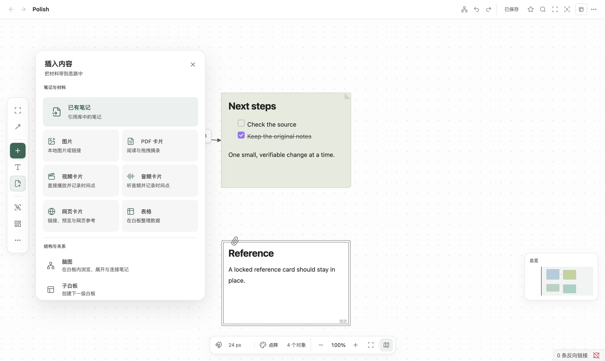
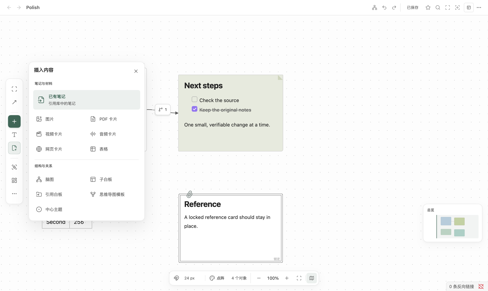
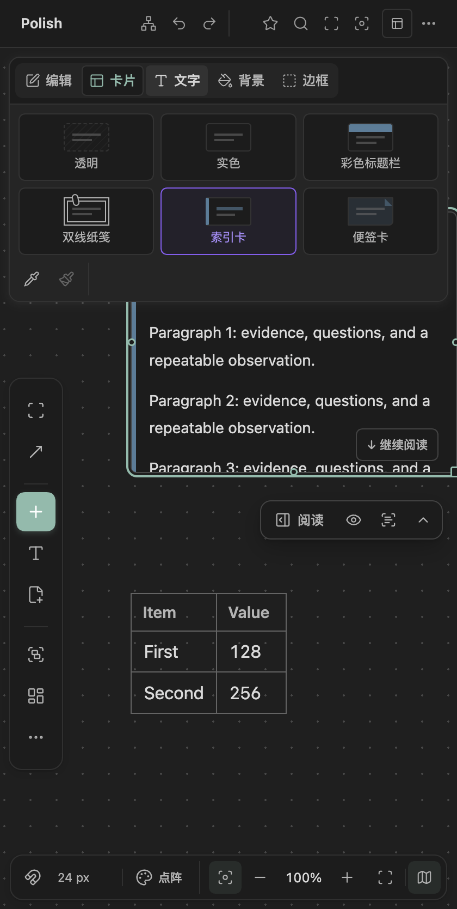
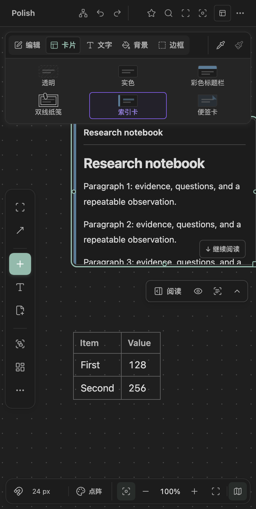
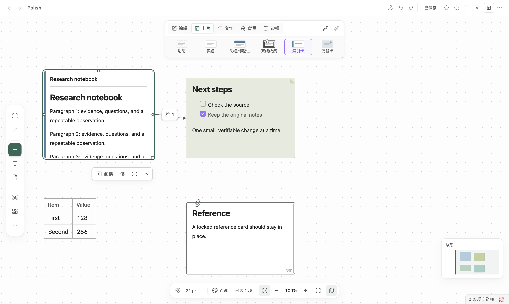
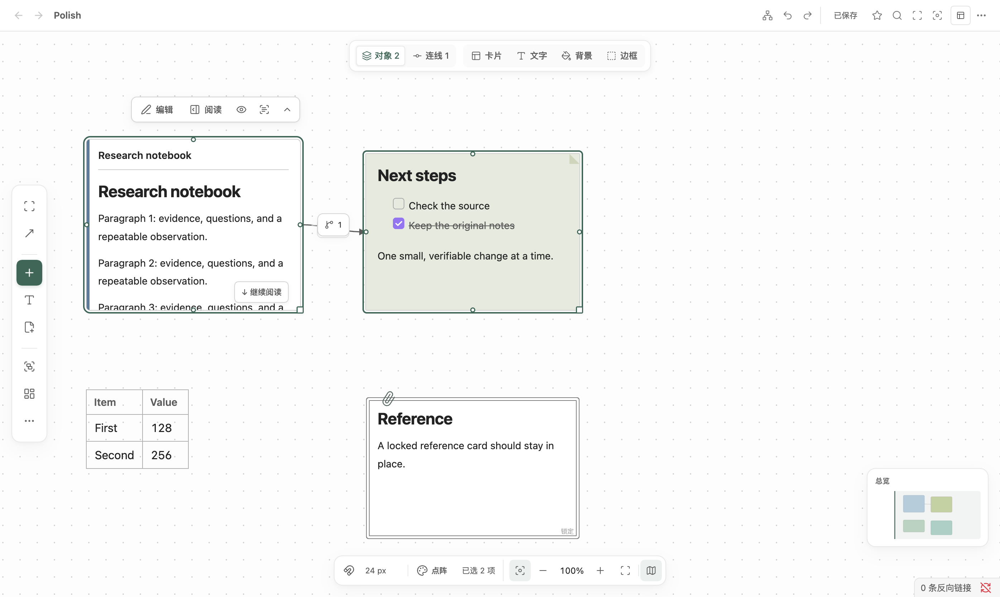
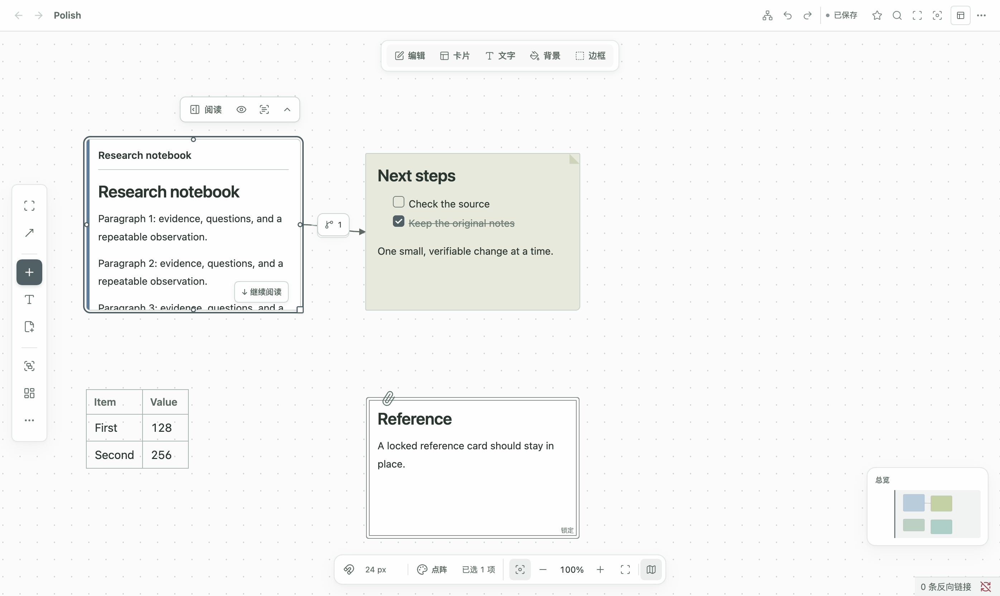
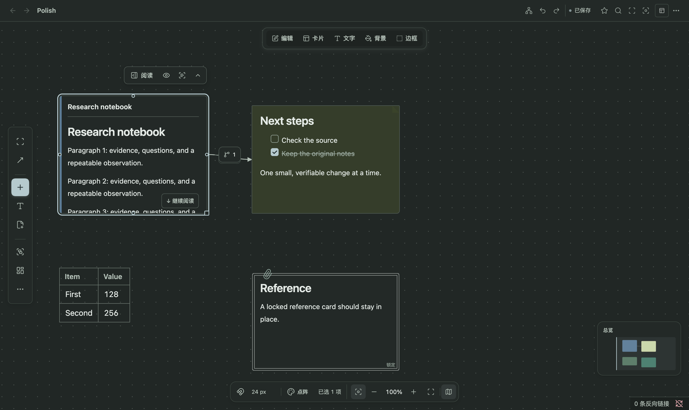
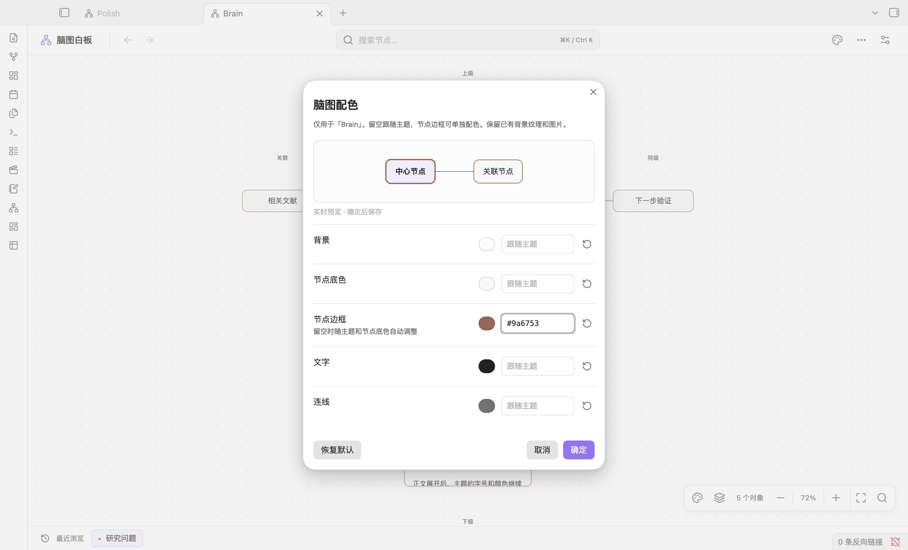
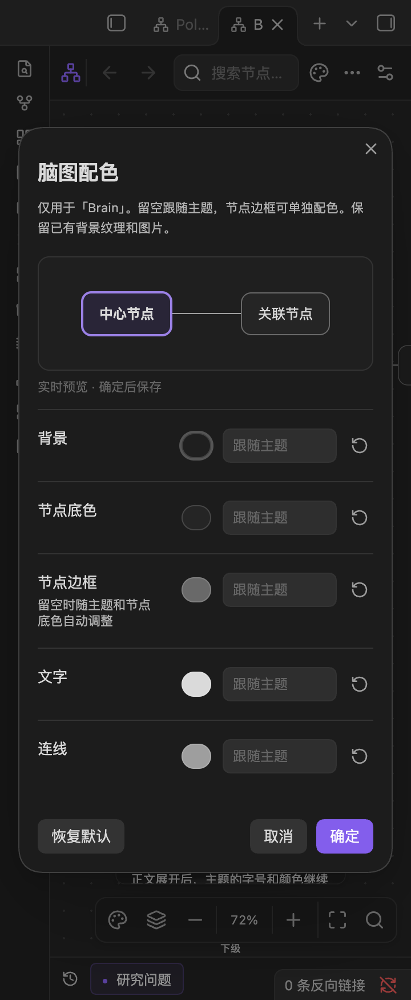

# 1.3.32 普通白板 UI 验收 / Ordinary whiteboard UI review

日期：2026-10-08。基线为公开 **1.3.31**，源码提交 `c6cae7c81838440a2773d81fe4219a37aa894837`。本轮重点是普通白板的插入、卡片样式、多选及卡片操作条，补充脑图独立边框配色。全部截图来自合成资料，不含用户笔记。

## 界面改动

- 插入菜单保留原有 12 个入口，用紧凑图标和单行名称呈现，已有笔记入口保留用途说明；其他用途说明通过悬停查看。
- 六种卡片样式缩小图示和控件高度，保留完整名称与选中反馈。宽窗一行，窄窗按可用宽度换行；文字、背景、边框参数仍使用可横向访问的单行。
- 样式复制、粘贴并入工具栏首行。多选只保留共享计数，单卡操作在悬停或键盘聚焦时可达，折叠对象仍可直接展开。
- 阅读操作条同时比较横向与纵向可用空间，选择最近的可行位置。隐藏的编辑按钮不再占定位宽度，聚焦时重新保留空间。
- 编辑长草稿时，焦点移到工具栏或重新悬停保留临时尺寸，避免退回原尺寸后裁切；结束编辑及其他节点仍正常同步源几何。
- 脑图增加独立边框颜色及顶栏配色入口。预览不重建图、阅读 DOM 或相机；确认、取消、恢复默认、撤销和保存沿用原有保护。

正文排版、Obsidian 字体设置和已有卡片的内容及坐标未因这次 UI 改造被重写。没有添加运行时依赖。

同时核对了本地 `thoughtspace-colors-candidate`：清单为 1.3.30，CSS 与公开 1.3.31 一致；完整构建 JavaScript 仅有一处依赖路径注释不同，功能代码已包含在 1.3.31。没有用旧二进制覆盖新版。此次独立边框颜色在新版源码上实现并测试。

## 原生截图与迭代

使用独立的桌面 Obsidian **1.14.4**、临时配置和测试库，不在用户资料库内写入测试。实际窗口为 1440 × 874 CSS px、Retina 2 倍；另检查 640 / 420 px 桌面窄面板和 360 px 脑图配色窗口。420 px 检查不等于移动端验收。

| 阶段 | 原生检查 | 截图 | 发现与处理 |
| --- | --- | --- | --- |
| 1.3.31 基线 | 72 / 72 | 49 张普通白板及 8 张脑图基线图，另存 | 固定样本和尺寸，记录原布局与耗时 |
| 候选第一轮 | 170 / 176 | 86 | 六项探针把设计宽度误写成 330 px，实际为 332 px；人工看图另外发现旧 CSS 使隐藏说明文字变成竖排，修正选择器并增加可见性与单行检查 |
| 候选第二轮 | 204 / 217 | 86 | 九项真实失败指向剩余的 DOM append：复制/粘贴被移回第二容器，窄窗多占一行；修正。另四项探针按实际 CSS 像素和悬停走廊调整：56.5 px 取整允许 1 px，25 px 走廊须小于 36 px 控件高度 |
| 候选第三轮 | **226 / 226** | **88** | 此轮所有检查通过；发布前独立代码复核又定位活动草稿 focusout 裁切路径，新增两项真实事件闭包测试先红后绿，补做原生专项与完整复验 |
| 旧构建编辑专项 | 15 / 21，预期红测退出码 1 | 5 | 真实键盘输入 16 段文字后 DOM 高度 1,200 px；聚焦及点击 Markdown、背景、文字工具栏时退回源高度 60 px，六项几何检查失败，草稿文字仍在 |
| 最终第四轮 | **247 / 247** | **93** | 编辑专项全部转绿，源高度仍为 60 px，临时 DOM 高度保持 1,200 px；真实保存后退出编辑并精确落盘，折叠再展开通过。无页面或已处理插件错误，退出码 0 |

最终样本与基线相同，普通白板 fixture SHA-256：`3fca5986215afbbddf59dbab4f151b20b8467570c5c5ffd0dae56618befb3a8c`。脑图 fixture：`861865a2e91f09b1e68debb2a5cae91c5bed8e8c9bd28f6c136d4fed25c4f634`。失败记录未覆盖成通过记录，每轮保存在不同输出目录。

下方新版截图全部取自最终第四轮。长草稿专项在不同主题中检查相同几何，不作为配色对比；只修改测试文本对象，三份普通合成笔记与五份脑图笔记仍保持原始内容一致。

### 代表截图

桌面插入菜单：1.3.31 → 1.3.32，同一合成布局。

| 1.3.31 | 1.3.32 |
| --- | --- |
|  |  |

420 px 桌面面板的卡片样式栏：完整名称，复制/粘贴留在首行。

| 1.3.31 | 1.3.32 |
| --- | --- |
|  |  |

最终桌面样式栏、近处的阅读按钮与多选悬停操作：





Folio Atelier 浅色与深色主题：

| 浅色 | 深色 |
| --- | --- |
|  |  |

脑图独立边框实时预览与 360 px 配色弹窗：

| 独立边框预览 | 窄窗弹窗 |
| --- | --- |
|  |  |

### 实测布局

| 项目 | 基线 / 早期候选 | 最终 |
| --- | --- | --- |
| 桌面插入菜单 | 392 × 578 px（基线） | 332 × 456 px，12 个入口首屏可见 |
| 单项卡片样式 | 62 px 高（基线） | 44 px 高 |
| 420 px 样式栏 | 第一轮候选 185 px 高 | 151 px 高，首行操作 + 两行样式，无额外复制行 |
| 桌面 / 640 px 样式栏 | — | 103 px 高 |
| 单选笔记操作条 | 隐藏编辑按钮仍占位 | 168 px 宽；单选文本操作条 68 px |

一次代表避障案例中，旧横向优先算法将阅读操作移到卡片右侧 401 px 之外；新算法选择卡片下方的较近空位。真实鼠标从卡片移动到操作条、阅读命中与折叠点击均通过，未只按静态坐标判断。

## 交互、数据与回归

- 原生鼠标/键盘验证 50%、100%、200% 缩放下拖动和调整尺寸；Esc 取消、键盘撤销均恢复。多选拖动保持相对位置，一次撤销同时恢复；锁定卡片不能移动或调整尺寸。
- 长笔记及脑图阅读区用真实滚轮滚到末段。白板相机不随正文滚动，预览 DOM 保留；展开/折叠恢复尺寸和正文。脑图仍采用有界内部阅读视口，并非无限扩高。
- 实际点击验证样式复制、粘贴、未复制前禁用、锁定目标禁用与撤销。折叠工具栏不留样式转移操作。
- 多选拖动释放后及测试窗失焦返回后，首次悬停操作条实际命中阅读按钮且不与顶部栏重叠；后者没有新 pointerenter，覆盖了这一无新进入事件的恢复路径。只验证本次浅色桌面组合，不泛化所有系统失焦场景。
- 脑图五项配色检查实时预览、取消、确认、磁盘保存、撤销及恢复默认；普通三份合成笔记保持精确字节一致，脑图五份笔记保持哈希一致。
- Folio Atelier 3.29.1 从本机只读复制到隔离库，浅深主题下背景、正文、弱文字及字体变量继续与宿主一致；没有改写主题。
- 全量 TypeScript 自动测试 **6,267 / 6,267**；发布脚本 Python 测试 **7 / 7**；TypeScript 与构建通过；lint **0 错误、118 条既有警告**。生成 CSS 与提交内容一致。

可复现脚本及运行说明见 [native QA harness](ordinary-board-ui-1332/README.md)。截图由脚本直接保存，公开 PNG 未裁剪或修改。原始报告含临时路径，仅保留本地；此文为去除本机路径的验收摘要。

## 流畅性与边界

隐藏的多选操作条在相机呈现时跳过邻近对象避障扫描，实际悬停或聚焦后再计算；回归样本中 120 次隐藏状态更新为 0 次扫描，悬停与聚焦仍正确触发计算。

相同 1,200 卡片、1 条关系的合成样本，视口裁剪后实际挂载 4 个节点，采样 120 次同步相机呈现：

| 阶段 | 中位数 | P95 |
| --- | --- | --- |
| 基线 | 1.20 ms | 2.10 ms |
| 第一轮 | 1.10 ms | 2.20 ms |
| 第二轮 | 1.10 ms | 2.10 ms |
| 第三轮 | 1.10 ms | 2.30 ms |
| 最终第四轮 | 1.10 ms | 2.20 ms |

这些是本机同步调用耗时，含小幅波动，不能转换成 FPS、物理输入延迟或整体加速结论，也不代表同时渲染 1,200 张卡片。没有做长时间内存、低端硬件、所有第三方主题或移动端验收。此前脑图内存增长、illegal access 和深层关系交叉的历史边界没有在此轮宣称解决。

视觉验收以层次、可达性、主题适配和真实操作为依据；Awwwards、Webby、FWA 获奖属于外部评审，本报告不宣称已经达到或保证获奖。

## Final runtime SHA-256

```text
de8724a4164ed1c0bb2e3a586ab20a99ffb64da3eebd8fe2fbffab1696256aa4  main.js
2dc270186dfca0a03f7a0763baad04b889f882f79b4a9609e1ca8a2dadd89644  styles.css
549d8e4a81dc9d1e21c17f0bb517a2b41e053c65cf28b784398f21eb618adac4  manifest.json
```

## English summary

The ordinary board retains all insertion and appearance actions with a smaller, clearer control hierarchy. Style transfer now lives in the first toolbar row, multi-selection uses shared controls, and card docks choose the nearest feasible horizontal or vertical position. Brain boards additionally support independent border colors with live preview and existing save/undo protections.

Four candidate rounds followed a frozen 1.3.31 baseline. Screenshot review found a cascading-style caption defect; native checks then exposed a remaining DOM append that moved transfer controls back into a separate row. A later independent review identified draft-size resets on focus transfer, reproduced by two event-closure tests and a native red test. The final run passes **247/247 native checks, captures 93 screenshots and records no page or handled plugin errors**. The automated suite passes **6,267 tests and 7 release-script tests**. Screenshots use synthetic notes in an isolated Obsidian 1.14.4 desktop profile, including light/dark themes, narrow panes and Folio Atelier. Long-body wheel scrolling preserves the camera and preview DOM; toolbar focus preserves live draft dimensions before save.

The 1,200-card sample mounts four viewport/overscan nodes; its synchronous renderer timings are comparable to baseline and do not establish a general speedup, FPS or long-term stability. Existing historical issues and untested platforms remain outside this change. Award quality is an aspiration, not an independently verified outcome.
